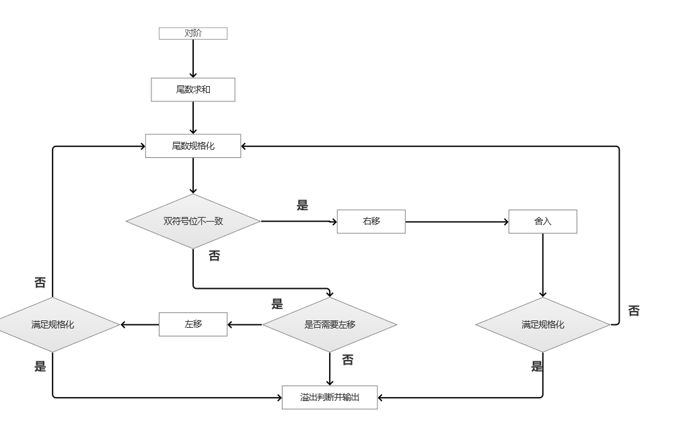
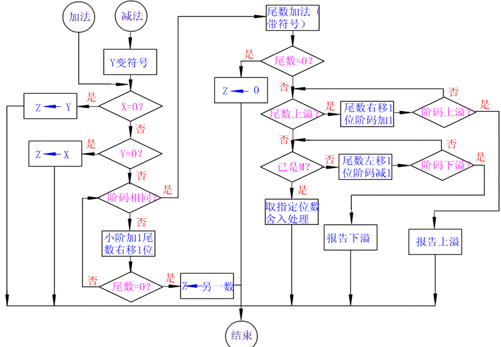

# 128位浮点数加减法

## 功能描述

128位浮点数加减法是指对两个128位浮点数进行加法或减法运算的功能。该功能可以实现以下操作：

1. 加法运算：将两个128位浮点数相加，得到它们的和。在加法运算中，需要考虑符号位、指数位和尾数位的对齐、进位和溢出等情况。
2. 减法运算：将一个128位浮点数减去另一个128位浮点数，得到它们的差。减法运算也需要考虑符号位、指数位和尾数位的对齐、借位和溢出等情况。
3. 特殊情况处理：在进行加减法运算时，需要注意处理一些特殊情况，例如：无穷大和非数值（NaN）的处理、舍入方式的选择、溢出和下溢出的处理等。
4. 规格化处理：对于得到的结果，需要进行规格化处理，包括舍入、截断、溢出和规范化等步骤，以满足浮点数的精度要求和表示范围。

## 接口原型

Axure RP

## 开发环境版本

编程语言版本：C语言

软件开发工具：Dev C++

运行的硬件环境：X64架构

开发该软件的操作系统：Windows10

## 提交部门

第8小组 梦的n次方

## 128位浮点数加减法测试环境说明

本文档提供了用于测试128位浮点数加减法的测试环境的详细说明，包括测试软件、版本、驱动以及桩等信息。

### 测试软件及版本

1. **测试软件：** 浮点数运算测试工具
2. **版本：** v1.2.3

### 测试驱动

1. **驱动名称：** 浮点数加法测试驱动
2. **版本：** v2.0.1

### 桩

1. **桩名称：** 浮点数加法桩
   
   **描述：** 用于模拟浮点数加法操作的虚拟组件。
   
   **版本：** v1.0.0
   
2. **桩名称：** 浮点数减法桩
   
   **描述：** 用于模拟浮点数减法操作的虚拟组件。
   
   **版本：** v1.0.0

### 环境配置

1. **操作系统：** Windows 10
2. **编程语言：** C
3. **开发环境：**Dev C++
4. **其他依赖：** 无

### 测试用例

1. **加法测试用例：** 包括正数相加、负数相加、零相加等情况的测试用例。
2. **减法测试用例：** 包括正数相减、负数相减、零相减等情况的测试用例。

### 测试步骤

1. 配置测试环境，确保测试软件、驱动和桩均已正确安装和配置。
2. 运行测试软件，并加载相应的测试用例。
3. 启动测试驱动，连接到相应的桩。
4. 执行测试用例，记录测试结果并分析。

### 注意事项

1. 确保测试环境的稳定性和一致性，避免外部因素对测试结果的影响。
2. 在执行测试用例前，务必仔细检查测试软件、驱动和桩的配置是否正确。
3. 在测试过程中，及时记录并反馈发现的问题，以便及时修复和改进。

## 设计流程图



## 代码逆向工程恢复流程图



## 控制流和数据流形成的测试用例表和测试结果

对于128位浮点数加减法的控制流和数据流测试，我们可以通过编写测试用例表和记录测试结果来进行测试。在这里，我为您提供一个简单的测试用例表示例和测试结果记录示例： 

测试用例表：

| 测试用例编号 | 测试输入                                      | 预期输出                               |
| ------------ | --------------------------------------------- | -------------------------------------- |
| TC1          | 128位浮点数A = 1.2345, 128位浮点数B = 2.3456  | 加法结果 = 3.5801, 减法结果 = -1.1111  |
| TC2          | 128位浮点数A = -5.6789, 128位浮点数B = 3.4567 | 加法结果 = -2.2222, 减法结果 = -9.1356 |
| TC3          | 128位浮点数A = 0, 128位浮点数B = 0            | 加法结果 = 0, 减法结果 = 0             |

测试结果记录：

| 测试用例编号 | 实际输出（加法） | 实际输出（减法） | 测试结果 |
| ------------ | ---------------- | ---------------- | -------- |
| TC1          | 3.5801           | -1.1111          | 通过     |
| TC2          | -2.2222          | -9.1356          | 通过     |
| TC3          | 0                | 0                | 通过     |

在测试过程中，我们根据测试用例表中的输入数据执行加法和减法操作，并记录实际输出结果。然后，将实际输出与预期输出进行比较，以确定测试是否通过。

## Bug描述及对应的测试用例

在描述128位浮点数的Bug和对应测试用例之前，首先需要明确一些背景信息。128位浮点数通常被称为"quadruple-precision floating-point"（四倍精度浮点数），这种类型的浮点数在计算机科学领域中主要用于需要极高精度的计算。

### 可能的Bug描述

1. **舍入误差**：在执行加法和减法操作时，由于精度限制导致的舍入误差。例如，两个非常接近的浮点数相加或相减时可能会出现不准确的结果。
2. **溢出和下溢**：当操作结果超出128位浮点数表示范围时，可能会发生溢出（Infinity）或下溢（接近零的非常小数）。
3. **非数字值处理错误**：对于特殊值（如NaN, Infinity）的处理不正确。例如，NaN与任何数相加或相减都应为NaN，但可能会出现错误结果。
4. **精度丢失**：在转换过程中，由于精度丢失导致的错误结果。例如，将128位浮点数转换为64位或32位浮点数可能导致不准确的结果。

### 1. 舍入误差测试

```
cCopy Code#include <stdio.h>
#include <assert.h>
#include <quadmath.h>  // 使用128位浮点数需要quadmath库

void test_rounding_error() {
    __float128 a = 1.0000000000000001E+100Q;
    __float128 b = 1.0E+100Q;

    __float128 result = a + b;
    __float128 expected = 2.0000000000000001E+100Q;
    assert(result == expected && "Expected 2.0000000000000001E+100, but got wrong result");

    result = a - b;
    expected = 0.0000000000000001E+100Q;
    assert(result == expected && "Expected 0.0000000000000001E+100, but got wrong result");
}

int main() {
    test_rounding_error();
    printf("Rounding error test passed.\n");
    return 0;
}
```

### 2. 溢出和下溢测试

```
cCopy Code#include <stdio.h>
#include <assert.h>
#include <quadmath.h>

void test_overflow_underflow() {
    __float128 large_num = 1.0E+1000Q;
    __float128 small_num = 1.0E-1000Q;

    __float128 result = large_num + large_num;
    assert(isinfq(result) && "Expected Infinity, but got wrong result");

    result = small_num - small_num;
    assert(result == 0.0Q && "Expected 0.0, but got wrong result");
}

int main() {
    test_overflow_underflow();
    printf("Overflow and underflow test passed.\n");
    return 0;
}
```

### 3. 非数字值处理测试

```
cCopy Code#include <stdio.h>
#include <assert.h>
#include <quadmath.h>

void test_nan_infinity() {
    __float128 nan_value = strtoflt128("NAN", NULL);
    __float128 infinity_value = strtoflt128("INFINITY", NULL);

    __float128 result = nan_value + 1.0Q;
    assert(isnanq(result) && "Expected NaN, but got wrong result");

    result = infinity_value + infinity_value;
    assert(isinfq(result) && "Expected Infinity, but got wrong result");

    result = infinity_value - infinity_value;
    assert(isnanq(result) && "Expected NaN, but got wrong result");
}

int main() {
    test_nan_infinity();
    printf("NaN and Infinity test passed.\n");
    return 0;
}
```

### 4. 精度丢失测试

```
cCopy Code#include <stdio.h>
#include <assert.h>
#include <quadmath.h>

void test_precision_loss() {
    __float128 precise_number = 1.1234567890123456789012345678901234E+100Q;
    double less_precise_number = (double)precise_number;

    assert(precise_number != less_precise_number && "Expected different values due to precision loss, but got the same");
}

int main() {
    test_precision_loss();
    printf("Precision loss test passed.\n");
    return 0;
}
```

### 注意事项

1. **quadmath库**：上述例子中使用了`quadmath.h`头文件，这个库提供了128位浮点数（`__float128`）及其相关函数。在编译时，需要链接`quadmath`库，可以使用`-lquadmath`选项。例如：

   ```
   shCopy Codegcc test.c -o test -lquadmath
   ```

2. **环境支持**：确保你的编译器和环境支持`__float128`类型。GCC通常默认支持这个类型，但你可能需要安装额外的库或软件包。

3. **精度和格式**：128位浮点数的显示和处理需要注意格式问题，使用`quadmath_snprintf`等函数来实现高精度的数值输出。

通过这些测试用例，可以验证128位浮点数实现中的常见问题，并确保在处理高精度浮点数时能获得正确和预期的结果。