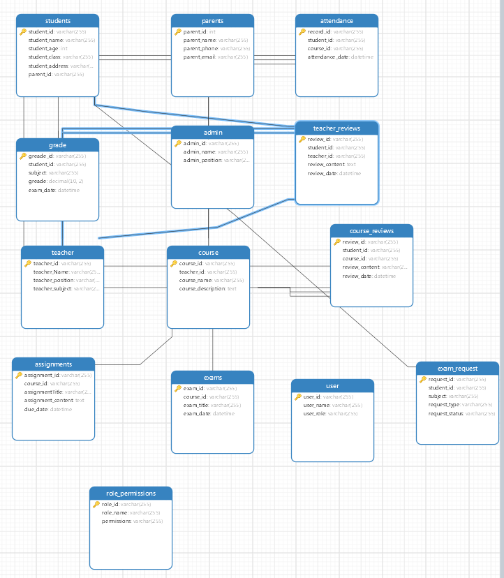

## 第十二小组 ERD 数据模型设计

数据模型在项目中具有重要的意义，它对于设计和管理数据是至关重要的。

1. **数据结构定义**：数据模型定义了项目中使用的数据结构，包括实体、属性和关系。它确定了数据的组织方式，使得数据在系统中能够被有效地存储和管理。
2. **数据一致性和准确性**：通过数据模型的设计，可以确保数据在项目中的一致性和准确性。数据模型规定了数据的规范和约束条件，可以限制数据的输入和操作，避免数据的冗余、不一致或错误。
3. **数据查询和操作**：数据模型定义了数据的结构和关系，使得对数据的查询和操作变得更加方便和高效。通过定义适当的实体和属性，可以支持各种数据查询和操作需求，提供有效的数据访问和处理能力。
4. **数据安全性和权限控制**：数据模型可以帮助确定数据的安全性需求，并支持相应的权限控制。通过定义数据模型中的实体和关系，可以限制用户对数据的访问和操作权限，确保数据的安全和保密性。
5. **系统扩展和演化**：良好设计的数据模型能够支持系统的扩展和演化。当项目需要添加新的功能或适应变化的需求时，合理的数据模型可以提供灵活性和可扩展性，减少对现有数据结构的影响和改动。

以下是对我们项目的数据模型设计的描述：

### students表

- 属性
  - student_id(字符串)：学生ID
  - student_name(字符串)：学生姓名
  - student_age(整型)：学生年龄
  - student_class(字符串)：学生班级
  - student_address(字符串)：学生地址
  - parent_id(字符串)：家长ID 外键

### parents表

- 属性
  - parent_id(字符串)：家长ID
  - parent_name(字符串)：家长姓名
  - parent_phone(字符串)：家长电话
  - parent_email(字符串)：家长邮箱

### attendance表

- 属性
  - record_id(字符串)：记录ID
  - student_id(字符串)：学生ID
  - course_id(字符串)：班级ID
  - attendance_date(datetime)：出勤时间

### grade表

- 属性
  - grade_id(字符串)：成绩ID
  - student_id(字符串)：学生ID
  - subject(字符串)：课程
  - grade(浮点类型)：成绩
  - exam_date(datetime)：考试时间

### admin表

- 属性
  - admin_id(字符串)：管理员ID
  - admin_name(字符串)：管理员姓名
  - admin_position(字符串)：管理员位置

### teacher_reviews表

- 属性
  - review_id(字符串)：复习时间
  - student_id(字符串)：学生ID
  - teacher_id(字符串)：教师ID
  - review_content(text)：复习内容
  - review_date(datetime)：复习时间

### teacher表

- 属性
  - teacher_id(字符串)：教师ID
  - teacher_name(字符串)：教师姓名
  - teacher_position(字符串)：教师职位
  - teacher_subject(字符串)：教师所教科目

### course表

- 属性
  - course_id(字符串)：课程ID
  - teacher_id(字符串)：教师ID
  - course_name(字符串)：课程名
  - course_description(字符串)：课程描述

### course_reviews表

- 属性
  - review_id(字符串)：复习ID
  - student_id(字符串)：学生ID
  - course_id(字符串)：课程ID
  - review_content(text)：复习内容
  - review_date(datetime)：复习时间

### assignments表

- 属性
  - assignment_id(字符串)：分配ID
  - course_id(字符串)：课程ID
  - assignmentTitle(字符串)：分配名称
  - assignment_content(text)：分配内容
  - due_data(datetime)：时间

### exams表

- 属性
  - exam_id(字符串)：考试ID
  - course_id(字符串)：课程ID
  - exam_title(字符串)：考试标题
  - exam_date(datetime)：考试时间

### user表

- 属性
  - user_id(字符串)：用户ID
  - user_name(字符串)：用户名
  - user_role(字符串)：用户角色

### exam_request表

- 属性
  - request_id(字符串)：请求ID
  - student_id(字符串)：学生ID
  - subject(字符串)：课程
  - request_type(字符串)：请求类型
  - request_status(字符串)：请求状态

### role_permissions表

- 属性
  - role_id(字符串)：角色ID
  - role_name(字符串)：角色名
  - permissions(字符串)：允许

## 以下是数据模型图

