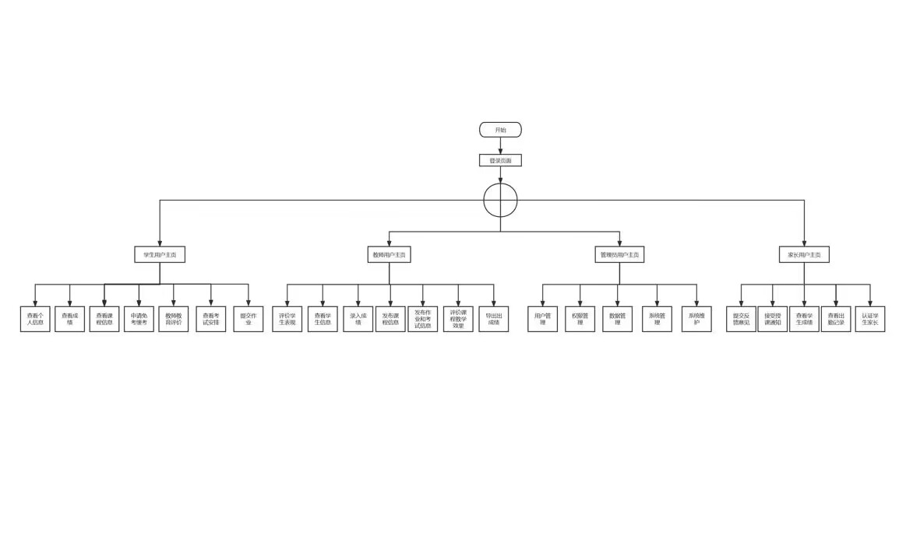
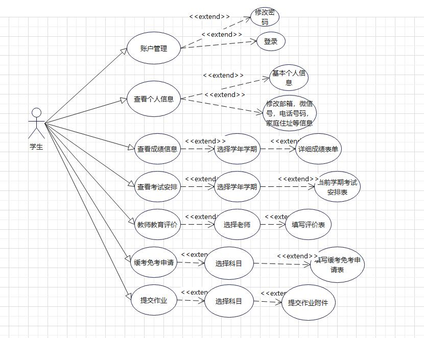
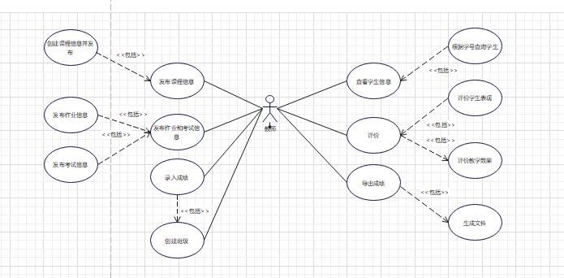
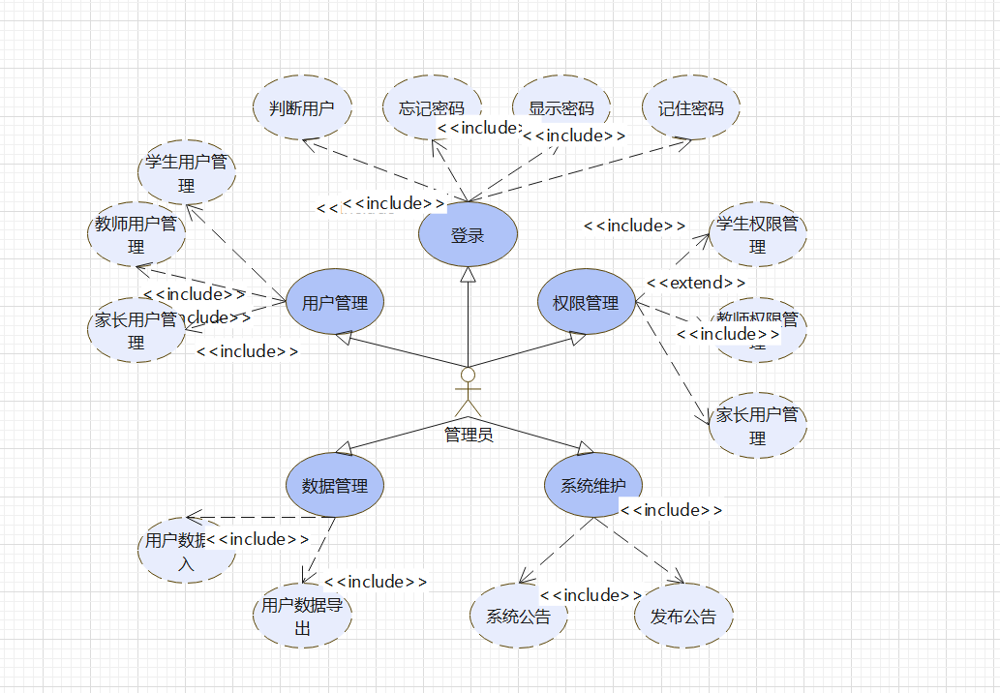
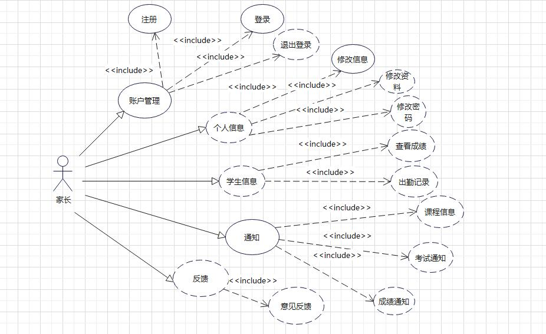

# 第七小组项目 UML 设计

## 1. 引言

本设计文档旨在详细描述成绩管理系统的 UML 设计，以便开发团队能够全面理解系统的结构、功能和关系。该文档旨在为项目成员提供一个统一的参考，以便他们能够更好地理解和协同工作。

成绩管理系统是一个用于学校或教育机构的应用程序，旨在帮助学校管理和记录学生的课程成绩。系统提供了学生信息管理、课程管理和成绩计算等功能，以简化学校的成绩管理流程并提高效率。

设计文档将从类图、时序图和状态图等方面详细描述系统的设计和实现。它将展示系统中的各个类、属性、方法和关系，并描述它们之间的交互和行为。

该设计文档的目标是确保项目成员对成绩管理系统的设计有清晰的理解，并为开发、测试和维护提供必要的指导。通过详细描述系统的设计，可以减少误解和沟通障碍，提高开发效率和团队合作能力。

请注意，本设计文档仅用于说明成绩管理系统的概念和设计，具体的实现细节和技术选择将在后续的开发和实施阶段进行详细讨论和决定。

在阅读本设计文档之前，请确保您具备必要的软件开发和 UML 建模知识，以便更好地理解和运用文档中的内容。

## 2.项目结构

绘制项目结构图的意义在于提供一个可视化的表示，以展示项目的整体结构、模块之间的关系和层次。以下是绘制项目结构图的几个重要意义：

1. **可视化沟通和理解**：项目结构图提供了一个直观的视觉工具，可以帮助团队成员更好地理解项目的组织结构和模块之间的关系。通过图形化的表示方式，可以更容易地进行沟通、交流和协作。

2. **模块划分和职责分配**：项目结构图可以帮助团队将项目划分为不同的模块或子系统，并明确每个模块的职责和功能。这有助于更好地分配任务和责任，使团队成员在开发过程中更加明确自己的工作范围和目标。

3. **可扩展性和灵活性**：通过绘制项目结构图，可以更好地规划和设计项目的可扩展性。通过定义清晰的模块和接口，可以更容易地进行功能的扩展和变更，而不会对整个系统造成过多的影响。

4. **风险管理和决策支持**：项目结构图可以帮助团队识别项目中的关键模块和依赖关系。这有助于识别潜在的风险和瓶颈，并为项目决策提供支持和指导。通过分析项目结构图，团队可以更好地评估和管理项目的风险，采取相应的措施以降低潜在的问题和挑战。

5. **文档和知识共享**：绘制项目结构图有助于创建项目文档，记录项目的组织结构和关键信息。这样的文档可以被用作项目的参考资料，并且有助于知识的共享和传承。团队成员可以通过查阅项目结构图来获取关于项目组织和设计的信息，从而更好地理解和参与项目。

总而言之，绘制项目结构图对于项目的规划、组织和沟通具有重要意义。它可以帮助团队成员更好地理解项目，分配任务和责任，管理风险，支持决策，并促进团队之间的合作和知识共享。

## 3.用例图

绘制用例图在软件开发过程中具有重要的意义，以下是几个主要的方面：

1. **需求分析和沟通**：用例图是一种可视化的工具，可以帮助团队更好地理解用户需求和系统功能。通过绘制用例图，可以清晰地描述系统与外部用户（包括角色和系统之间的交互）之间的关系和行为。这有助于准确捕捉需求，并促进团队与利益相关者之间的沟通和共识。

2. **功能设计和规划**：用例图可以作为功能设计的基础，帮助团队确定系统的功能边界和功能需求。通过识别和建模各种用例，可以更好地划定系统的功能范围，并有助于任务的分解和规划。用例图还可以用于确定用例的优先级和重要性，帮助团队合理安排开发工作。

3. **系统架构和模块设计**：用例图可以帮助团队理解系统的整体架构和模块之间的关系。通过标识和建模不同的用例，可以识别系统中的各个功能模块，并确定它们之间的依赖关系。这有助于设计和规划系统的组织结构，指导模块的划分和职责分配。

4. **测试计划和验收标准**：用例图可以用作测试计划和验收标准的依据。通过绘制用例图，可以明确系统的各个功能点和用户场景，从而指导测试团队设计测试用例和执行测试工作。用例图还可以用作验收标准的参考，帮助验证系统是否满足了用户需求和功能规格。

5. **文档和知识共享**：用例图可以作为项目文档的一部分，记录系统的功能和行为描述。这样的文档可以作为项目的参考资料，供开发人员、测试人员和其他利益相关者查阅和使用。用例图还可以促进知识的共享和传承，帮助新成员快速了解系统的功能和交互方式。

总而言之，绘制用例图对于需求分析、功能设计、系统架构、测试计划和文档编制等方面都具有重要的意义。它提供了一种清晰且易于理解的方式来描述系统的功能和用户交互，促进团队沟通和共识，指导开发和测试工作，同时也是项目文档和知识共享的重要组成部分。

### 学生用例

### 教师用例

### 管理员用例

### 家长用例

